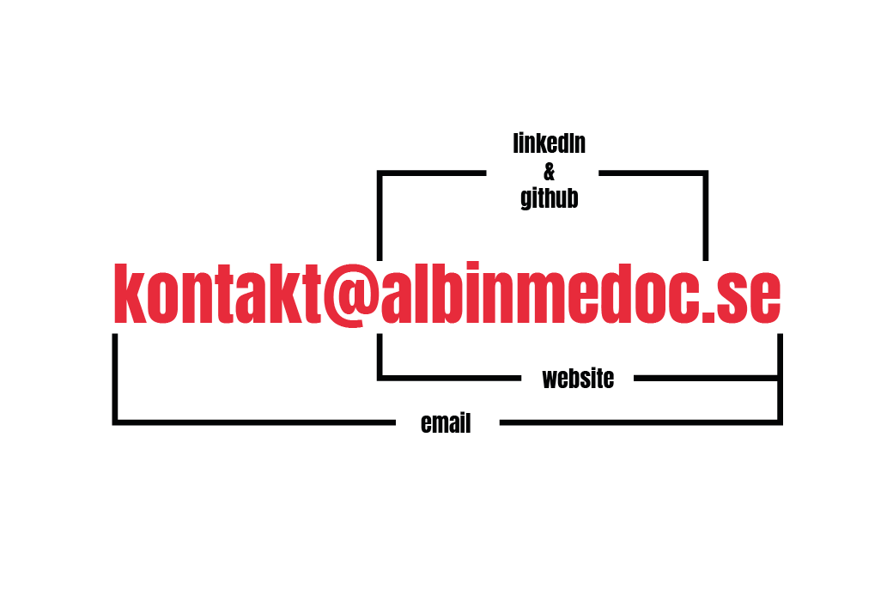

<h1 align="center" width="600px">   I'm <a href="https://www.linkedin.com/in/albin-m%C3%A9doc-6a295b1aa">Albin Médoc</a>. Welcome to my GitHub! 🤗</h1>

## About me

I´m 21 years old and currently studying information architecture at Malmö University.

My biggest strengths are building full-stack applications with TypeScript, Svelte, MongoDB, Node, Git, and more. I am also flexible and open to learning new programming languages.

My education as an information architect has given me a burning passion for user-centered design, usability and front-end development.

I am dedicated and always finish what I have started.

## Connect with me

|  |  |  |  |  |
| :--------------------------------------------------------------------------------------: | :--------------------------------------------------------------------------------------------------------------------------------------------------: | ----------------------------------------------------------------------------------------------------------------------- | --------------------------------------------------------------------------------------------------------------------------------------- | ---------------------------------------------------------------------------------------------------------------------- |
